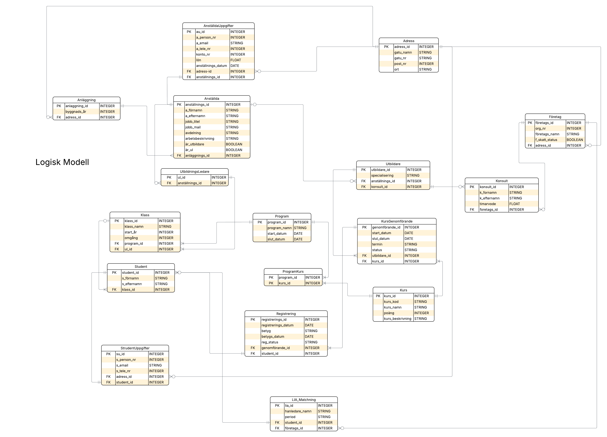

# Labb - Data Modellering 

## Introduktion
Uppgiften i denna labb var att skapa en databas för den fiktiva yrkeshögskolan YrkesCo utifrån en kravspecifikation som underlag. 
Målet var att ersätta deras nuvarande manuella hantering i Excel med en robust, centraliserad och skalbar SQL-databas. 


För mer information om labben: \
[Labb_beskrivning (PDF)](/bilder/lab_yrkesco.pdf)
## Video-pitch

# Arbetsprocess
## 1. Datamodellering
Först gjorde jag själva datamodelleringen i form av ett ERD (Entity Relationship Diagram). Detta innebar att jag analyserade kravspecifikationen för att identifiera verksamhetens viktigaste byggstenar (entiteter) och hur de hänger ihop (relationer), vilket resulterade i en konceptuell modell.\
Därefter utvecklade jag den logiska modellen. Här definierade jag specifika attribut för varje tabell samt datatyper för att säkerställa att strukturen uppfyller kraven för 3NF (Tredje normalformen). Slutligen översatte jag den logiska designen till en fysisk modell i dbdiagram, vilket lade grunden för den faktiska SQL-implementeringen.

## Konseptuell modell


## Logisk modell
 

### 3NF - Third Normal Form
- 1NF – Databasen uppfyller 1NF genom att eliminera flervärdesattribut och upprepade grupper. Varje entitet har en tydlig definierad primärnyckel (PK) och samtliga attribut en enhetlig datatyp
- 2NF – Databasen uppfyller 2NF genom att inga andra attribut förekommer i tabellen ProgramInnehåll som har två primärnycklar, en så kallad sammansatt nyckel
- 3NF – Databasen uppfyller 3NF genom att alla "non-prime" attribut är direkt och uteslutande beroende av primärnyckeln

## Fysisk modell
 

## 2. Implementering med Docker Compose
Efter modelleringen översatte jag min design till SQL-kod och körde den i en PostgreSQL-container via Docker. För att hantera konfigurationen skapade jag en docker-compose.yml-fil och en .env-fil för säker hantering av miljövariabler.
För att skapa en ny container och köra i Docker:

### Guide: Starta och anslut till databasen

1. Kolla om någon container är igång/"helthcheck":
```bash
docker ps
```
2. Starta containern (skapa image, volym och nätverk):
```bash
docker compose up -d
```
3. Anslut direkt till PostgreSQL i containern:
```bash
docker exec -it yrkco psql -U yrkesco -d yrkco_db
```
4. Lägg till tabeller (tables):
```bash
\i sql/ddl_create_table.sql
```
5. Lägg till ädringar (ALTER table):
```bash
\i sql/ddl_alter_table.sql
``` 
6. Lägg till data (VALUES):
```bash
\i sql/dml_insert_data.sql
```
7. Stänga ned containern & volym:
```bash
docker compose down -v
``` 

## 3. Verifiering & Validering 
För att säkerställa att databasen uppfyller kraven har jag genomfört följande tester:
- Constraints: Verifierat att felaktig data (t.ex. ogiltiga betyg eller felaktiga e-postformat) stoppas vid inmatning.
- Dataintegritet: Testat att kopplingar mellan tabeller (Foreign Keys) förhindrar att exempelvis studenter läggs till i klasser som inte existerar.
- Analys: Skapat JOIN-frågor som hämtar ut meningsfull data, exempelvis procentandelen studenter med LIA-plats per anläggning.

## Hjälp och Källor
ERD
- [Conseptual Model](https://github.com/AIgineerAB/data_modeling_course/tree/main/03_erd_conceptual_model)
- [Logical & Physical Model](https://github.com/AIgineerAB/data_modeling_course/tree/main/04_erd_logical_physical_model)

Setup's & Docker-compose
- [Setup postgreSQL](https://github.com/AIgineerAB/data_modeling_course/tree/main/05_setup_postgres)
- [Setup Docker](https://github.com/AIgineerAB/data_platform_course/tree/main/04_setup_docker)
- [Run postgres using Docker](https://mkyong.com/docker/docker-running-postgresql-as-a-container/)

3NF
- [Normalization](https://github.com/AIgineerAB/data_modeling_course/tree/main/07_normalization)

Övrigt
- [Create table with foreign key](https://www.geeksforgeeks.org/sql/how-to-create-a-table-with-a-foreign-key-in-sql/)


- Jag har även haft stor nytta av anteckningar från lektioner och tidgare arbeten med Regular Expression och SQL-queries. 
- Jag har använt LLM för att generera fejk data (VALUES) och som stöd/bollplank i vissa moment där jag inte lyckats hitta svaret (eller problemet) på egen hand. 
